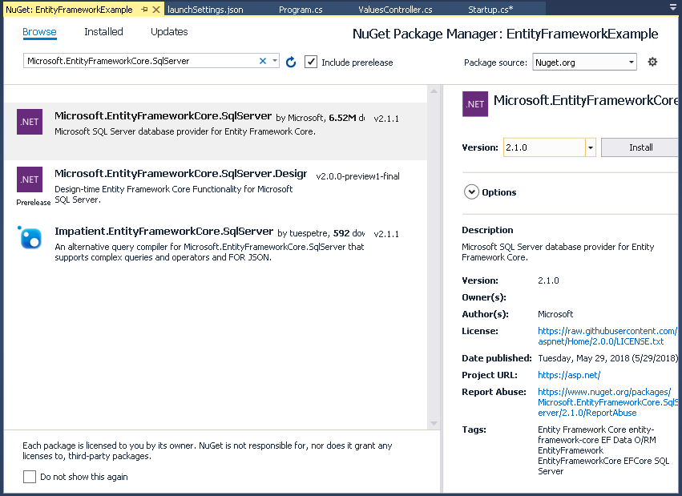

+++
title = "ASP.NET Core API with Entity Framework"
description = ""
+++

This article is a how-to on building a simple API with ASP.NET Core and Entity Framework. 

The source can be found on Github at https://github.com/codenesium/ASP.NET-Core-Examples/tree/master/EntityFrameworkExample

The example uses a very simple database I call IOT which could be used to control IOT devices via an API.

This example is missing lots of important stuff. This list isn't comprehensive.

1. Security
2. Versioning
3. Dependency Injection
4. Validation
5. Configuration
6. Logging
7. Tests
8. Entity Framework Configuration
9. Swagger
10. Migrations


For examples on how to create a production API please see https://github.com/codenesium/samples

To generate an API for your database see https://www.codenesium.com/


This is the database. 
```
USE [master]
GO

CREATE DATABASE [IOT]

GO

CREATE TABLE [dbo].[Device](
	[id] [int] IDENTITY(1,1) NOT NULL,
	[name] [varchar](90) NOT NULL,
	[publicId] [uniqueidentifier] NOT NULL,
 CONSTRAINT [PK_Device] PRIMARY KEY CLUSTERED 
(
	[id] ASC
)WITH (PAD_INDEX = OFF, STATISTICS_NORECOMPUTE = OFF, IGNORE_DUP_KEY = OFF, ALLOW_ROW_LOCKS = ON, ALLOW_PAGE_LOCKS = ON) ON [PRIMARY]
) ON [PRIMARY]

GO
SET ANSI_PADDING OFF
GO
/****** Object:  Table [dbo].[DeviceAction]    Script Date: 6/25/2018 5:27:36 PM ******/
SET ANSI_NULLS ON
GO
SET QUOTED_IDENTIFIER ON
GO
SET ANSI_PADDING ON
GO
CREATE TABLE [dbo].[DeviceAction](
	[id] [int] IDENTITY(1,1) NOT NULL,
	[deviceId] [int] NOT NULL,
	[name] [varchar](90) NOT NULL,
	[value] [varchar](4000) NOT NULL,
 CONSTRAINT [PK_Action] PRIMARY KEY CLUSTERED 
(
	[id] ASC
)WITH (PAD_INDEX = OFF, STATISTICS_NORECOMPUTE = OFF, IGNORE_DUP_KEY = OFF, ALLOW_ROW_LOCKS = ON, ALLOW_PAGE_LOCKS = ON) ON [PRIMARY]
) ON [PRIMARY]

GO
SET ANSI_PADDING OFF
GO
/****** Object:  Index [IX_Device]    Script Date: 6/25/2018 5:27:36 PM ******/
CREATE UNIQUE NONCLUSTERED INDEX [IX_Device] ON [dbo].[Device]
(
	[publicId] ASC
)WITH (PAD_INDEX = OFF, STATISTICS_NORECOMPUTE = OFF, SORT_IN_TEMPDB = OFF, IGNORE_DUP_KEY = OFF, DROP_EXISTING = OFF, ONLINE = OFF, ALLOW_ROW_LOCKS = ON, ALLOW_PAGE_LOCKS = ON) ON [PRIMARY]
GO
/****** Object:  Index [IX_DeviceAction_DeviceId]    Script Date: 6/25/2018 5:27:36 PM ******/
CREATE NONCLUSTERED INDEX [IX_DeviceAction_DeviceId] ON [dbo].[DeviceAction]
(
	[deviceId] ASC
)WITH (PAD_INDEX = OFF, STATISTICS_NORECOMPUTE = OFF, SORT_IN_TEMPDB = OFF, DROP_EXISTING = OFF, ONLINE = OFF, ALLOW_ROW_LOCKS = ON, ALLOW_PAGE_LOCKS = ON) ON [PRIMARY]
GO
ALTER TABLE [dbo].[DeviceAction]  WITH CHECK ADD  CONSTRAINT [FK_DeviceAction_Device] FOREIGN KEY([deviceId])
REFERENCES [dbo].[Device] ([id])
GO
ALTER TABLE [dbo].[DeviceAction] CHECK CONSTRAINT [FK_DeviceAction_Device]
GO
USE [master]
GO
ALTER DATABASE [IOT] SET  READ_WRITE 
GO

```

The first thing you need to do is create this database in SQL server on your machine. 

If you don't have SQL Server you can download it [here](https://www.microsoft.com/en-us/sql-server/sql-server-editions-express)


Next create a new ASP.NET Core web project


Set the options. We're going to use an empty project. 


Install the Entity Framework package from nuget.

```
Install-Package Microsoft.EntityFrameworkCore.SqlServer
```



Entity Framework will reverse engineer everything you need from your exising database. You can also build your model in Entity Framework and it can create your database.
In this example we're going to use an existing database.
To scaffold the Entity Framework context run the database script on a database and then from the package manager console run this command with your server info filled in.
```
Scaffold-DbContext "Server=localhost;Persist Security Info=False;User ID=test;Password=Passw0rd;Initial Catalog=IOT;MultipleActiveResultSets=True;Connection Timeout=300;" Microsoft.EntityFrameworkCore.SqlServer -OutputDir Models
```


Next add your controller. The all method will return all of the devices in the database.
```
using EntityFrameworkExample.Models;
using Microsoft.AspNetCore.Mvc;
using System.Linq;
using System.Threading.Tasks;

namespace EntityFrameworkExample
{
    [Route("api/devices")]
    public class DevicesController : Controller
    {
        [HttpGet]
        public async virtual Task<IActionResult> All()
        {
            using (var context = new IOTContext())
            {
                var devices = context.Device.ToList();
                return this.Ok(devices);
            }
        }
    }
}

```

Startup.cs is where all of your application setup occurs. We're adding 

```
services.AddMvc();
```
and
```
app.UseMvc();
```
These are required to add routing and the other things needed for controllers to function. 

```
using Microsoft.AspNetCore.Builder;
using Microsoft.AspNetCore.Hosting;
using Microsoft.Extensions.DependencyInjection;

namespace EntityFrameworkExample
{
    public class Startup
    {
        // This method gets called by the runtime. Use this method to add services to the container.
        // For more information on how to configure your application, visit https://go.microsoft.com/fwlink/?LinkID=398940
        public void ConfigureServices(IServiceCollection services)
        {
            services.AddMvc();

        }

        // This method gets called by the runtime. Use this method to configure the HTTP request pipeline.
        public void Configure(IApplicationBuilder app, IHostingEnvironment env)
        {
            if (env.IsDevelopment())
            {
                app.UseDeveloperExceptionPage();
            }

            app.UseMvc();
        }
    }
}
```

Run the project. 

The API endpoint is
```
http://localhost:5000/api/devices
```

The json response from our API
```
[{"id":1,"name":"asqGjFBZso","publicId":"92025a7d-65ec-5106-b03c-0f19718814b6","deviceAction":[]},{"id":2,"name":"sOTeyZVZqt","publicId":"222d1adf-3da1-5c62-82c1-a01a3a4ae060","deviceAction":[]},{"id":1002,"name":"string","publicId":"00000000-0000-0000-0000-000000000000","deviceAction":[]}]
```


Included here are the other files in the project. These are all generated so I won't go into detail on how they work. 


Program.cs
```
using Microsoft.AspNetCore;
using Microsoft.AspNetCore.Hosting;

namespace EntityFrameworkExample
{
    public class Program
    {
        public static void Main(string[] args)
        {
            CreateWebHostBuilder(args).Build().Run();
        }

        public static IWebHostBuilder CreateWebHostBuilder(string[] args) =>
            WebHost.CreateDefaultBuilder(args)
                .UseStartup<Startup>();
    }
}
```


The Entity Framework context
```
using System;
using Microsoft.EntityFrameworkCore;
using Microsoft.EntityFrameworkCore.Metadata;

namespace EntityFrameworkExample.Models
{
    public partial class IOTContext : DbContext
    {
        public IOTContext()
        {
        }

        public IOTContext(DbContextOptions<IOTContext> options)
            : base(options)
        {
        }

        public virtual DbSet<Device> Device { get; set; }
        public virtual DbSet<DeviceAction> DeviceAction { get; set; }

        protected override void OnConfiguring(DbContextOptionsBuilder optionsBuilder)
        {
            if (!optionsBuilder.IsConfigured)
            {
#warning To protect potentially sensitive information in your connection string, you should move it out of source code. See http://go.microsoft.com/fwlink/?LinkId=723263 for guidance on storing connection strings.
                optionsBuilder.UseSqlServer("Server=localhost;Persist Security Info=False;User ID=test;Password=Passw0rd;Initial Catalog=IOT;MultipleActiveResultSets=True;Connection Timeout=300;");
            }
        }

        protected override void OnModelCreating(ModelBuilder modelBuilder)
        {
            modelBuilder.Entity<Device>(entity =>
            {
                entity.HasIndex(e => e.PublicId)
                    .HasName("IX_Device")
                    .IsUnique();

                entity.Property(e => e.Id).HasColumnName("id");

                entity.Property(e => e.Name)
                    .IsRequired()
                    .HasColumnName("name")
                    .HasMaxLength(90)
                    .IsUnicode(false);

                entity.Property(e => e.PublicId).HasColumnName("publicId");
            });

            modelBuilder.Entity<DeviceAction>(entity =>
            {
                entity.HasIndex(e => e.DeviceId)
                    .HasName("IX_DeviceAction_DeviceId");

                entity.Property(e => e.Id).HasColumnName("id");

                entity.Property(e => e.DeviceId).HasColumnName("deviceId");

                entity.Property(e => e.Name)
                    .IsRequired()
                    .HasColumnName("name")
                    .HasMaxLength(90)
                    .IsUnicode(false);

                entity.Property(e => e.Value)
                    .IsRequired()
                    .HasColumnName("value")
                    .HasMaxLength(4000)
                    .IsUnicode(false);

                entity.HasOne(d => d.Device)
                    .WithMany(p => p.DeviceAction)
                    .HasForeignKey(d => d.DeviceId)
                    .OnDelete(DeleteBehavior.ClientSetNull)
                    .HasConstraintName("FK_DeviceAction_Device");
            });
        }
    }
}

```


Our Device entity
```
using System;
using System.Collections.Generic;

namespace EntityFrameworkExample.Models
{
    public partial class Device
    {
        public Device()
        {
            DeviceAction = new HashSet<DeviceAction>();
        }

        public int Id { get; set; }
        public string Name { get; set; }
        public Guid PublicId { get; set; }

        public ICollection<DeviceAction> DeviceAction { get; set; }
    }
}
```


