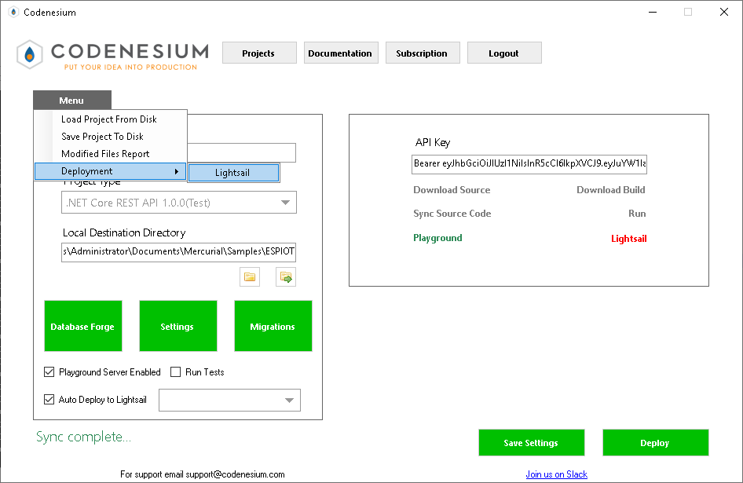
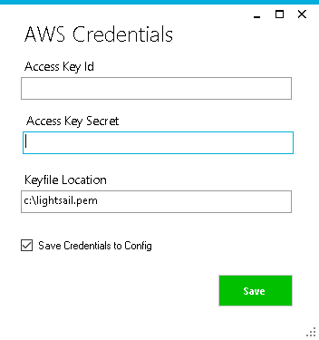
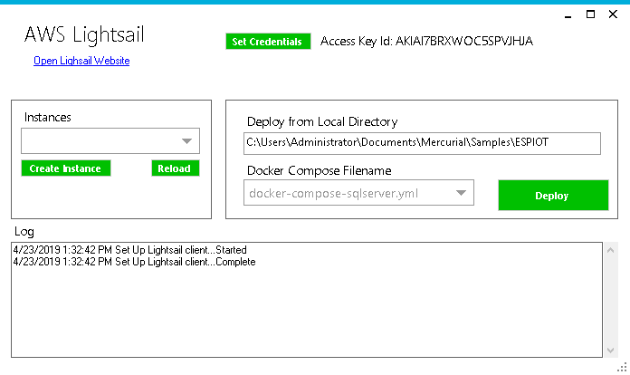
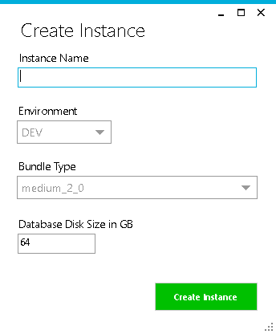
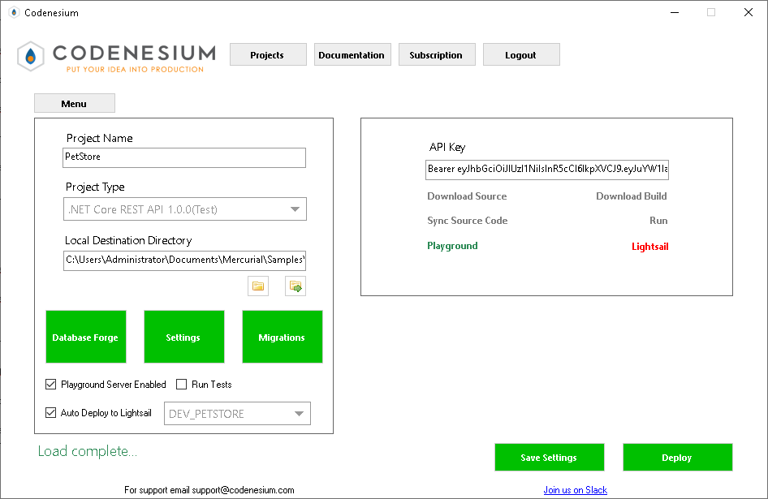
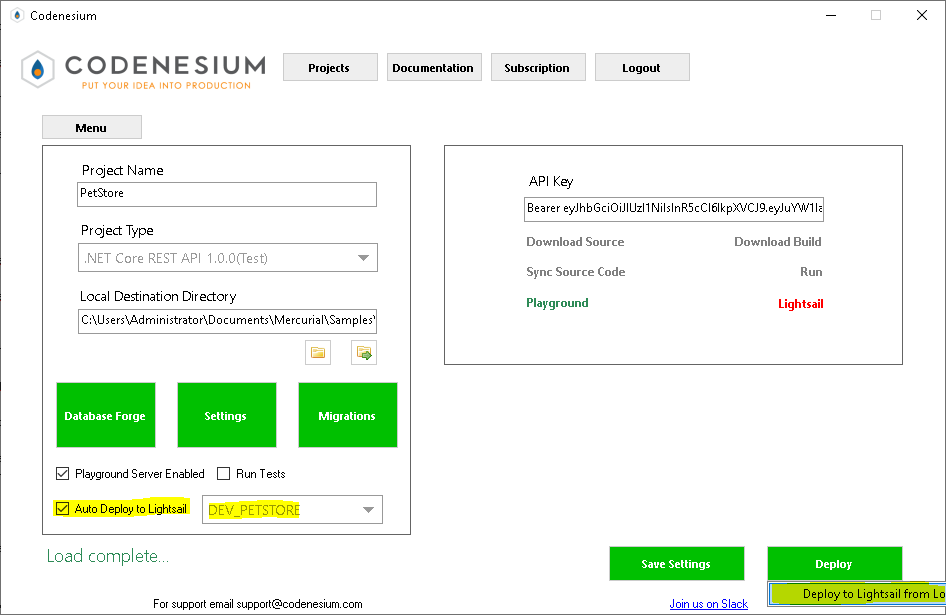

+++
title = "AWS Lightsail"
description = ""
weight = 1
alwaysopen = true
+++
The Codenesium application has built in tooling for deployment to AWS Lightsail.

[AWS Lightsail](https://aws.amazon.com/lightsail) is a very low cost VPS services. 

We support creating Lightsail instances and also deployment of a Codenesium application to Lightsail.

First you need to open the Lightsail manager

Next you need to configure your AWS Credentials

You can create API credentials from [AWS Security Credentials] (https://console.aws.amazon.com/iam/home?#/security_credentials)

The keyfile in this screen is a file you must download from [AWS Lightsail Security Credentials](https://lightsail.aws.amazon.com/ls/webapp/account/keys)

This keyfile will allow us to SSH into your instance and manage the instance.
 

From this screen you can create new machines and deploy.

When we create a new machine we take several steps.

1. Create a new Lightsail instance
2. Create a static IP
3. Assign the static IP to the instance
4. Create a disk
5. Assign the disk to the instance
6. Open firewall ports on the instance
7. SSH into the instance and format and attach the disk
8. SSH into the instance and install and configure Docker

When we deploy we package your source directory and transfer it to the instance where we unzip, build and then bring your app up with Docker.

Now when you regenerate you can auto deploy to your Lightsail instance.

You can also redeploy without regenerating by right clicking on the Deploy button. 

