+++
title = "Getting started"
description = ""
weight = 1
alwaysopen = true
+++

Install the [client](https://s3-us-west-2.amazonaws.com/codenesium-releases/Setup.exe) to get started.

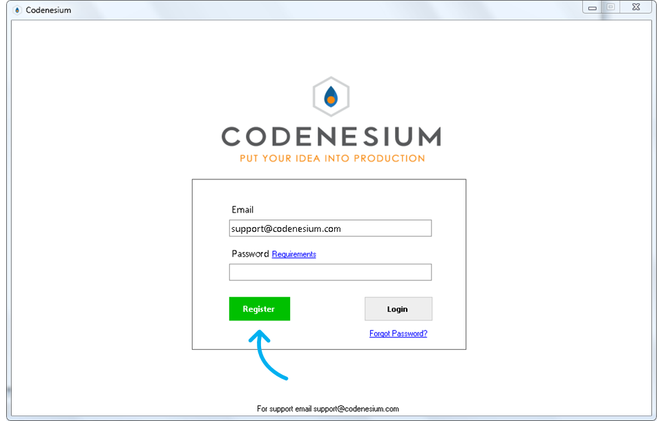
Register for an account. 

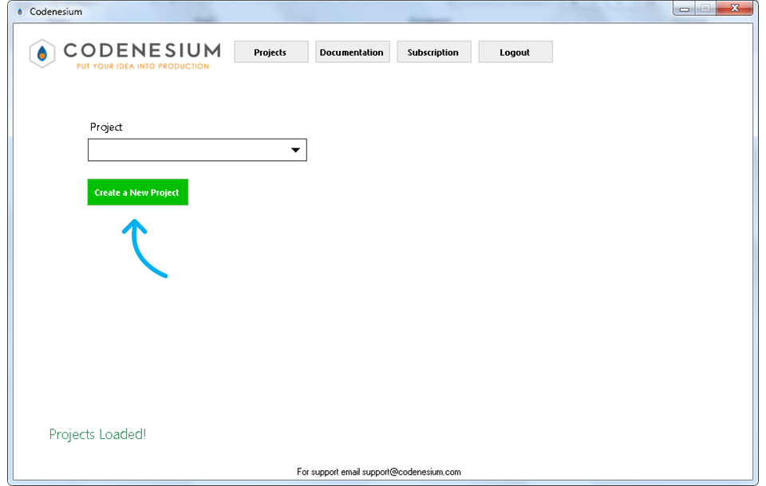
Create a new project.

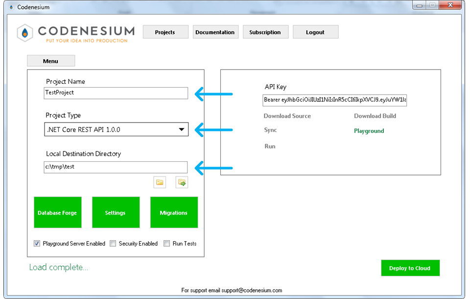
Fill out the project name, select a project type and set a local directory to sync souce code to.

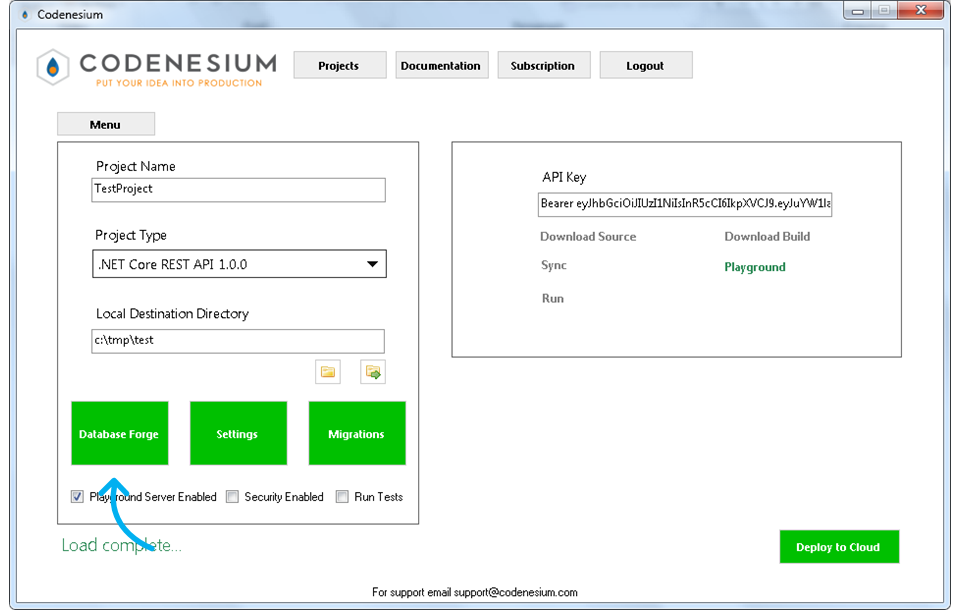
Open the Database Forge. This tool lets you design a database schema from scratch or you can load a database you already have. For this 
example we are going to load Adventure Works.

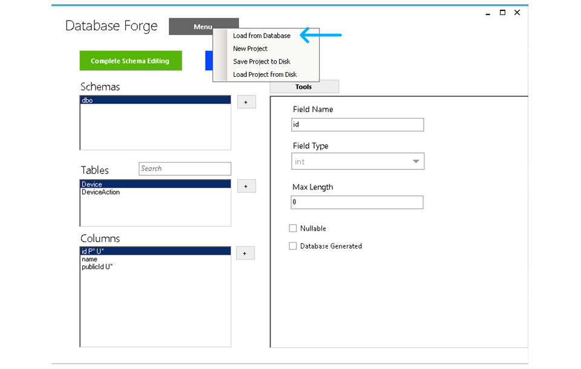
With the Database Forge open you can add your schema and the tables and columns. You can also load a schema from a SQL Server or PostgreSQL instance by clicking in the menu and selecting load from database.
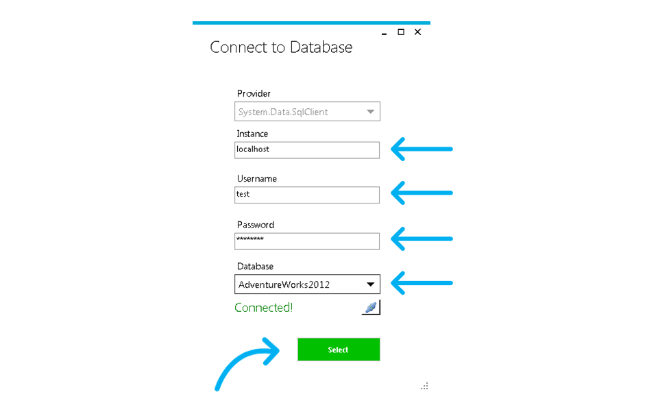
Fill out your credentials and you should get a notification if you are able to connect. 
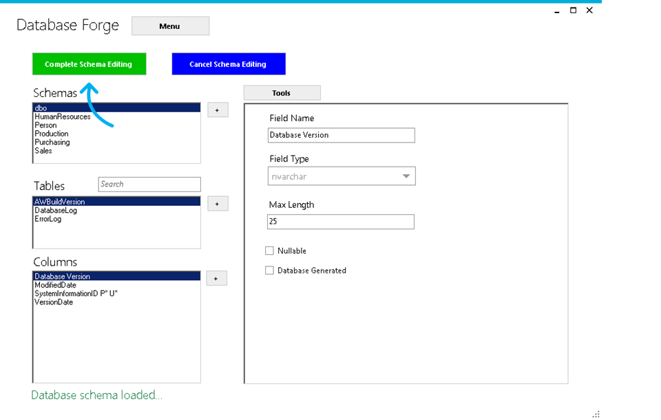
Click Complete Schema Editing to return to the Codenesium App. You may get errors on this step about 

* missing primary keys
* invalid primary key column types
* composite primary keys
* other validation errors

In most cases it's possible to still generate with validation errors but some tables or columns may be disabled. 

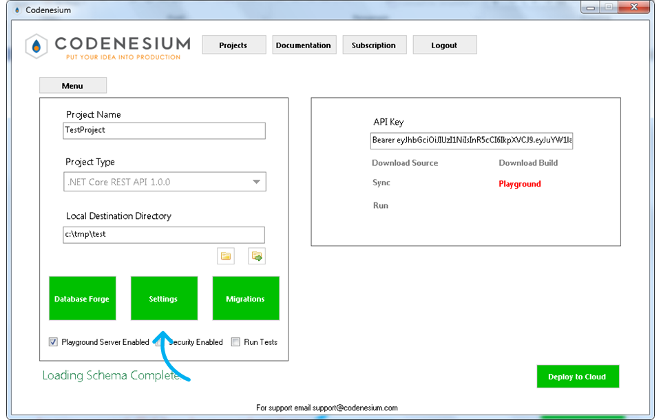
Optionally click settings to make changes to your schema. You can think of these settings as overriding the database schema. Don't make changes in the Database Forge
that don't really exist in your database. The settings editor is where most of your editing should happen.  
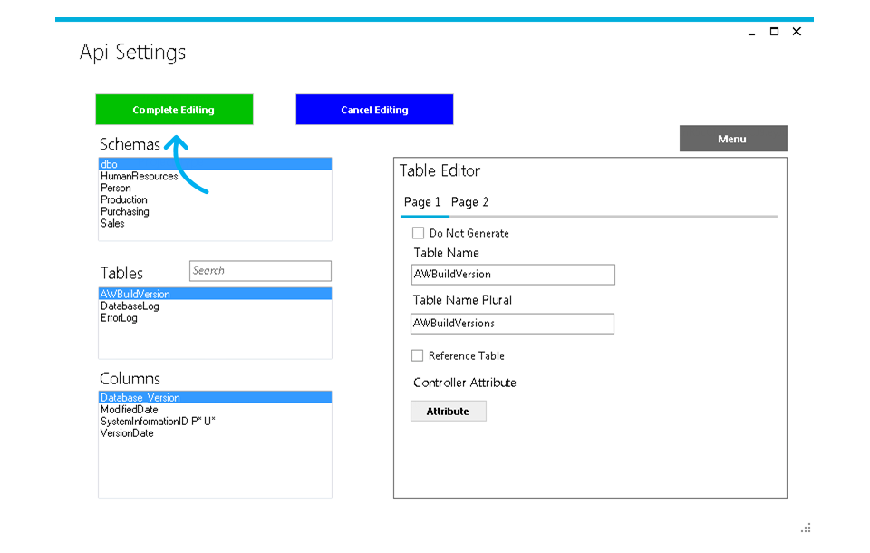
From the settings editor you can make various changes to the project.

* Rename tables and columns.
* Add virtual foreign keys and constraints.
* Disable generation of tables and columns.
* Add custom attributes on the generated controller and controller methods.
* Disable methods in the controller if for example you only want the Get method exposed. 
* Change the CLR type of the column.
* Set the default value on your models.
* Add boolean conversion for database columns that are a char with a value of 'Y' and 'N' to be a boolean in the generated code.
* Enable columns in the response or request.

Click Complete Editing when you are through
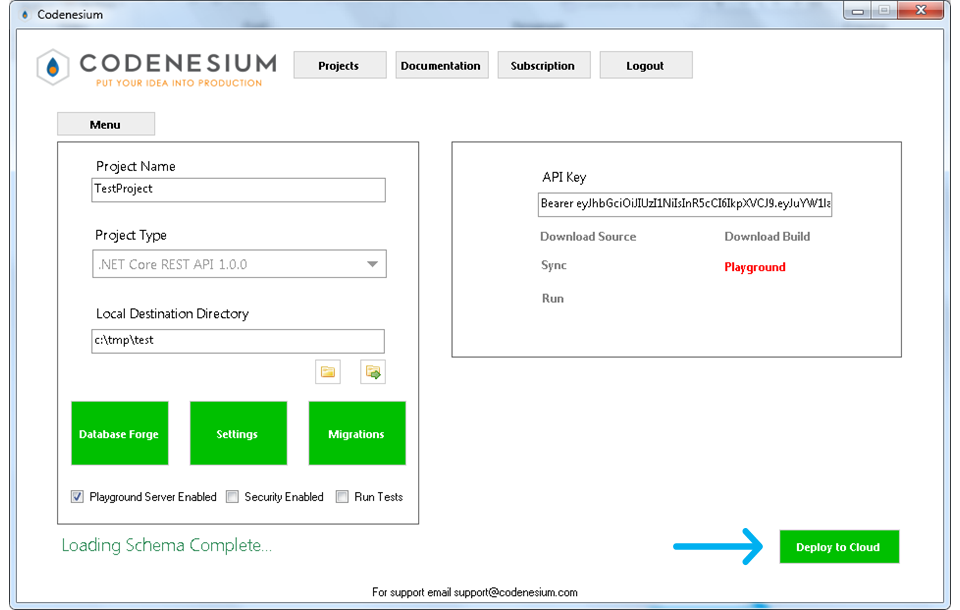
Click deploy to generate your project. It can take a few minutes to generate, build, test and deploy your project. Please be patient.
If an error occurs we are notified and will attempt to reach out to you to resolve the problem.
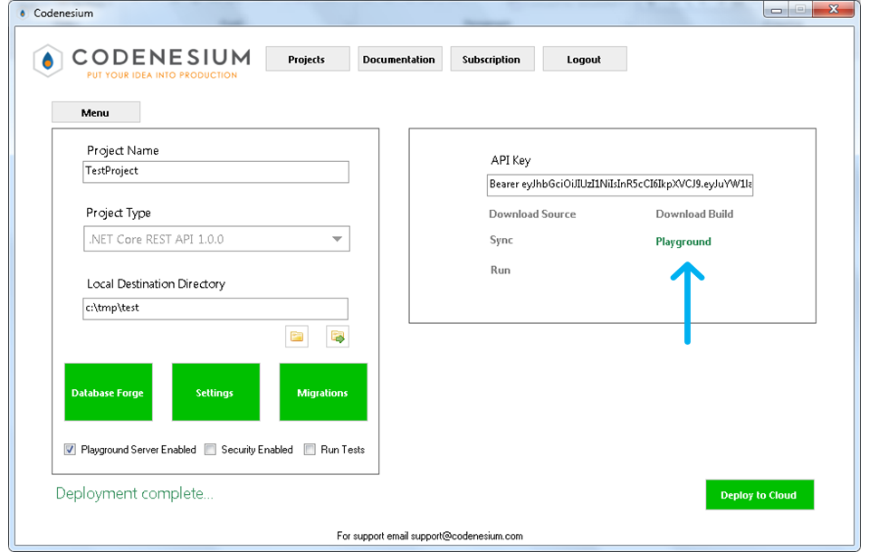
Click the playground link to see the Swagger enpoint on the playground server. 
The source code will be synced to the directory you provided. 
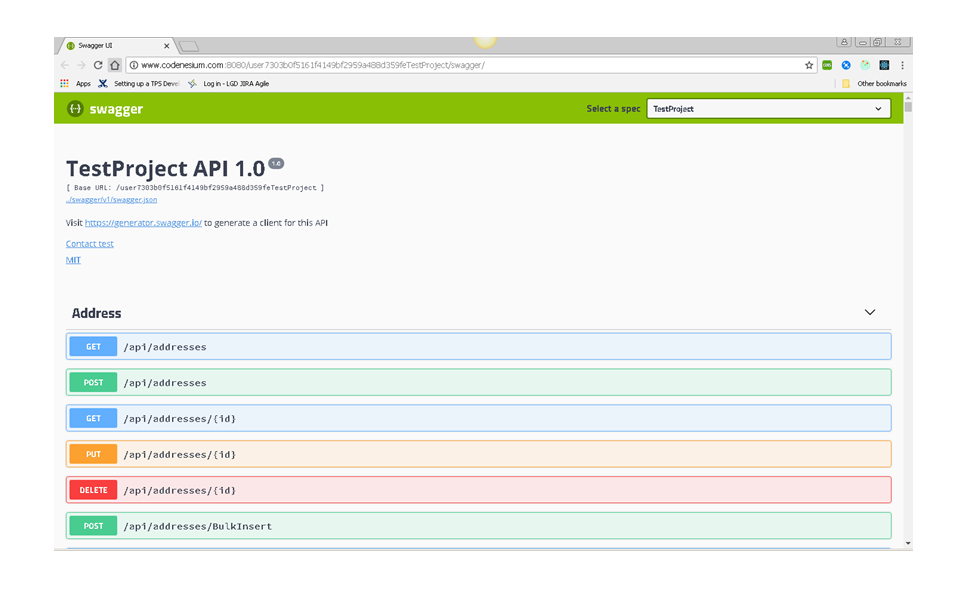
Use the swagger enpoint to test out your API. When your project is regenerated the database is reset. Add migrations using the migrations button
to create a SQL script that will run on every deployment. This is useful to populate your database with test data. 

* If you have any issues let us know at support@codenesium.com